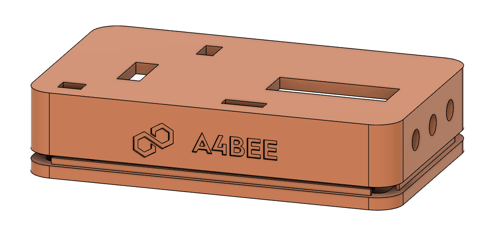
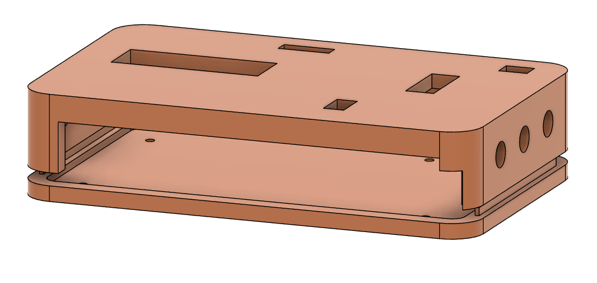
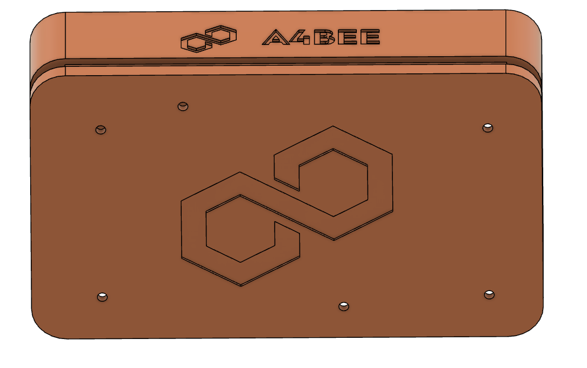

# Raspberry Pi Compute Module 4 IO Board case
3D case model for Raspberry Pi Compute Module 4 IO Board, designed in Fusion 360. Case has two parts that can be joined by clipping each other. The IO board can be mounted to bottom part with 4-6 M2.5 screws. 

## Montage
Case is easy to assembly due to special clips on bottom part. You just have to clutch them together. The IO board should be screwed to bottom part with at least 4 M2.5 screws and caps. It is recommended to glue anti-slip legs on the very bottom of the case.

## Model preview
Model in Fusion

Printed case

## Recommended printer settings
- Layer height: 0.40mm
- Infill: 20%
- use ABS-2 or other durable material
